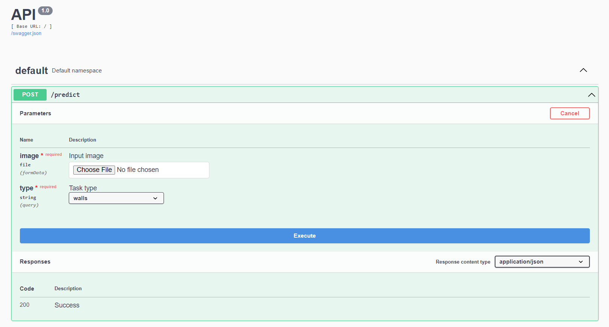
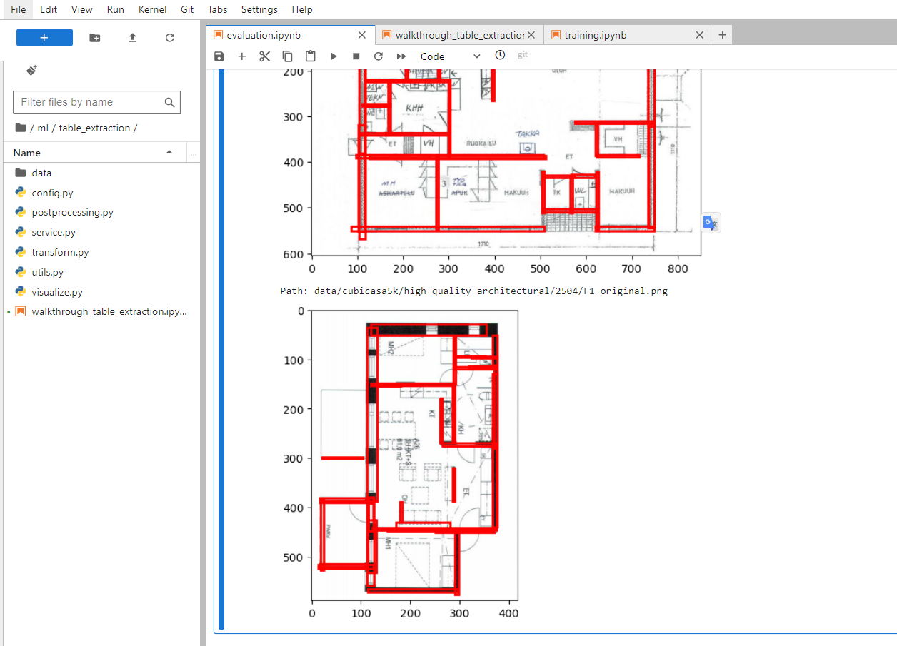

# Machine Learning Engineer Test: Computer Vision and Object Detection

## Objective
This test aims to assess your skills in computer vision and object detection, with a specific focus on detecting room walls and identifying rooms in architectural blueprints or pre-construction plans.

This test evaluates your practical skills in applying advanced computer vision techniques to a specialized domain and your ability to integrate machine learning models into a simple API server for real-world applications.

Choose one of the visual tasks, one of the text extraction tasks, and the API Server task. We encourage you to submit your tests even if you can’t complete all tasks.

Good luck!


## Full test description
[Senior Machine Learning Engineer.pdf](https://github.com/TrueBuiltSoftware/ml-eng-test/files/14545316/Senior.Machine.Learning.Engineer.1.pdf)

## PS
Share your project with the following GitHub users:
- vhaine-tb
- omasri-tb
- alexwine36

## Notice
Datasets and trained models are stored on gdrive with limited quota. Please contact with repo admin if some resources were blocked.

## Task solutions
In this repository we present solutions for two tasks: walls detection and table extraction.

### Walls detection
For detecting walls we used a Mask R-CNN [https://arxiv.org/pdf/1703.06870.pdf] trained on CubiCasa5k dataset [https://github.com/CubiCasa/CubiCasa5k]. Details about training including the training log can be found in `src\ml\walls_detection\training.ipynb` notebook. Details about experimental evaluation (quality & quantity analysis) can be found in `src\ml\walls_detection\evaluation.ipynb` notebook.

### Table extraction

For table extraction we used pretrained table transformers [https://huggingface.co/docs/transformers/model_doc/table-transformer] followed by EasyOcr [https://pypi.org/project/easyocr/]. The second considered OCR was TrOCR [https://huggingface.co/docs/transformers/en/model_doc/trocr]. TrOCR was performing poorly compared to Easy OCR and was removed. The full table extraction pipeline with step-by-step visualization can be found in `src\ml\table_extraction\walkthrough_table_extraction.ipynb` notebook.

## Cloning repository
This repository uses 1 submodule:
- https://github.com/LeoProPlus/CubiCasa5k
    - Fork of the official CubiCasa5k dataset repo. It is used for training. We utilize a few functions in order to read CubiCasa5k dataset.

 The best way to clone everything at once is to run the following command:

```
git clone --recurse-submodules https://github.com/LeoProPlus/ml-eng-test
```

## Runing smoke tests
In order to run smoke tests and to be sure that everything will work as expected, execute the following command from the project root directory

```
docker compose -f src/docker-compose.test.yml up --build
```

The test container should exit with status code `0` E.g.

```
webserver-test  | webserver/tests/test_api_smoke.py .....                                  [100%]
webserver-test  | 
webserver-test  | ------------ generated xml file: /home/jovyan/webserver/report.xml -------------
webserver-test  | ================== 5 passed, 2 warnings in 155.15s (0:02:35) ===================
webserver-test exited with code 0
```

## Installation

To install everything at once run the following command from project root directory:
```
docker compose -f src/docker-compose.dev.yml up --build
```

This command will start two applications:
1. Webserver for serving API with `Swagger` documentation available at http://127.0.0.1:5000/

    

2. JupyterLab available at http://127.0.0.1:8888/lab

    

## API Testing
For API testing purposes you can use `Swagger` available at [http:/localhost:5000](http://127.0.0.1:5000/), or you can use cURL. Example cURL commands are presented below.

### Example cURL
```
# walls
curl -X POST 'http://127.0.0.1:5000/predict?type=walls' -F 'image=@src/ml/walls_detection/data/examples/F1_original.png'
curl -X POST 'http://127.0.0.1:5000/predict?type=walls' -F 'image=@src/ml/walls_detection/data/examples/A-191.pdf_0_scaled.jpg'

# tables
curl -X POST 'http://127.0.0.1:5000/predict?type=tables' -F 'image=@src/ml/table_extraction/data/input/table_example.png'
curl -X POST 'http://127.0.0.1:5000/predict?type=tables' -F 'image=@src/ml/table_extraction/data/input/image_1.jpg'
curl -X POST 'http://127.0.0.1:5000/predict?type=tables' -F 'image=@src/ml/table_extraction/data/input/image_2.png'
curl -X POST 'http://127.0.0.1:5000/predict?type=tables' -F 'image=@src/ml/table_extraction/data/input/image_3.png'
```
